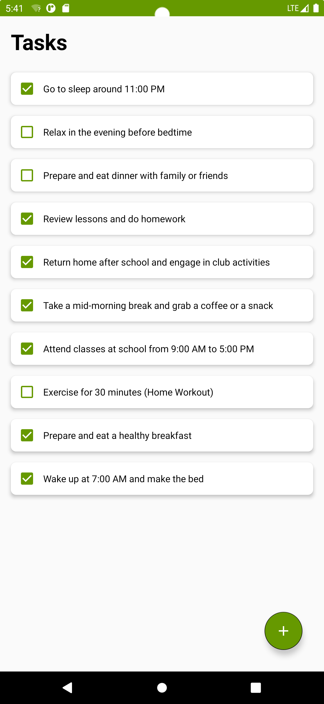
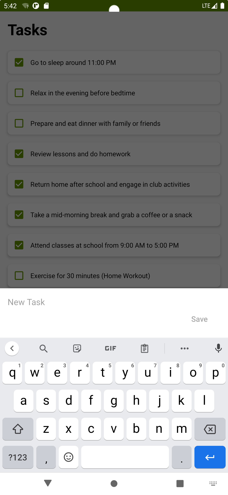
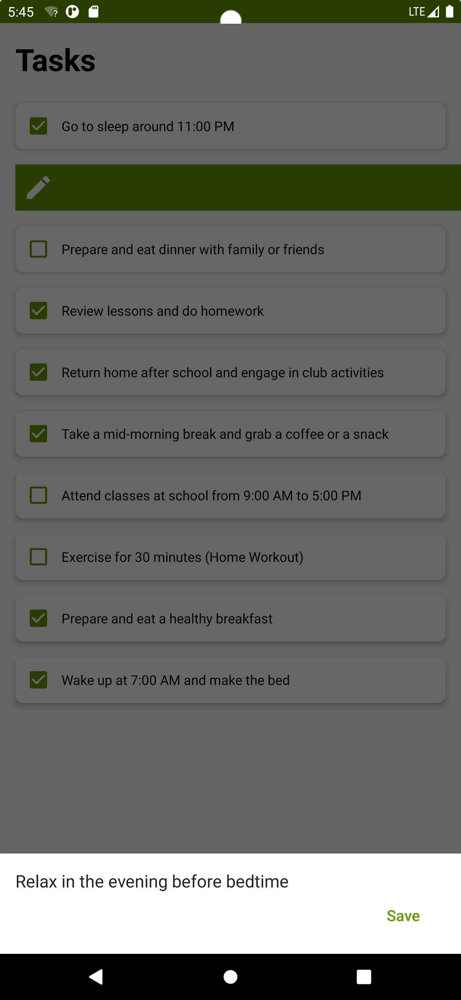
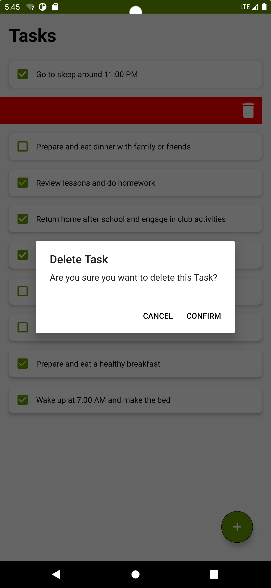

# Simple ToDo App

## Overview
This Simple ToDo App is an Android application designed to help users manage their daily tasks efficiently. The app allows users to create, edit, and delete tasks, making it easy to stay organized. The app is built using Android's RecyclerView and CardView for a modern, clean interface, and it utilizes an SQLite database to store tasks locally on the device.

## Features
- **Create Tasks**: Easily add new tasks to your list.
- **Edit Tasks**: Update existing tasks with new information.
- **Delete Tasks**: Remove tasks that are no longer needed.
- **Swipe Actions**: Use ItemTouchHelper to enable swipe-to-delete functionality.
- **Persistent Storage**: Tasks are stored in an SQLite database, ensuring they persist even when the app is closed.

## Technologies Used
- **RecyclerView**: Used for displaying the list of tasks in a scrollable view.
- **CardView**: Provides a card-style layout for each task in the list.
- **SQLite Database**: Manages the storage of tasks, ensuring data persistence.
- **ItemTouchHelper**: Implements swipe actions for tasks, such as deleting them with a simple gesture.

## Usage
1. **Add a Task**: Click the "+" button to create a new task.
2. **Edit a Task**: Tap on an existing task to edit its details.
3. **Delete a Task**: Swipe a task to the left or right to delete it.

## Acknowledgments
- The app is based on the Android development series that covers RecyclerView, CardView, SQLite Database, and ItemTouchHelper.
- Special thanks to the tutorial series on YouTube: "To Do List App Android Studio Tutorial".

## Screenshots

1. **Example of Tasks**: An example of tasks for a student.
   - 

2. **Add a Task**: Click the "+" button to create a new task.
   - 

| 3. **Edit a Task** | 4. **Delete a Task** |
|-----------------|--------------------|
| **Swipe Left to Edit** | **Swipe Right to Delete** |
|  |  |

